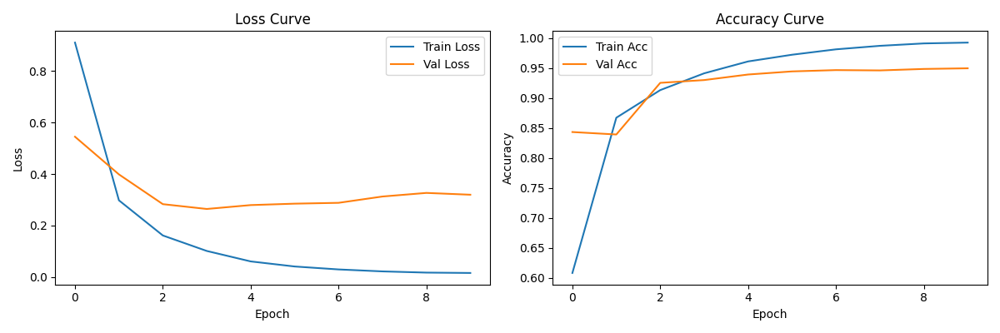
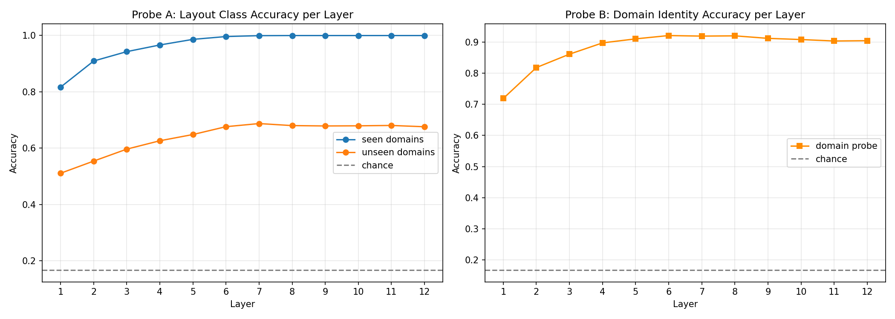
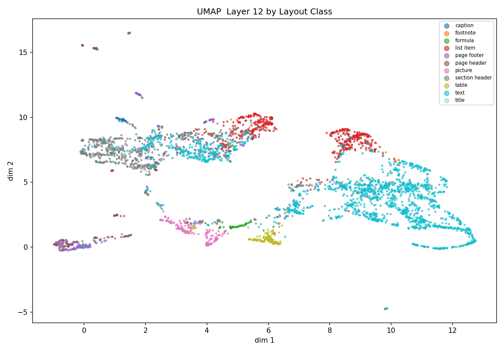
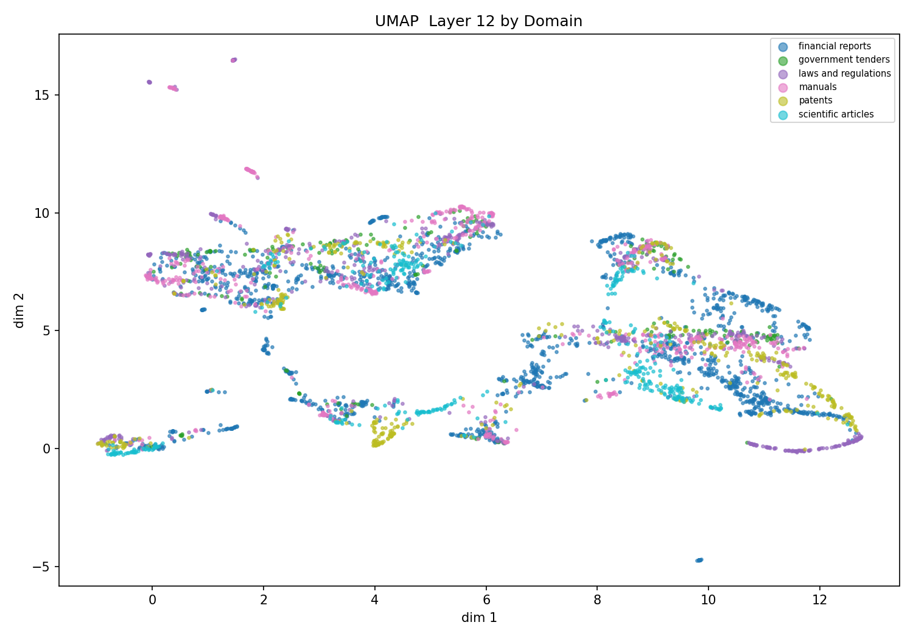
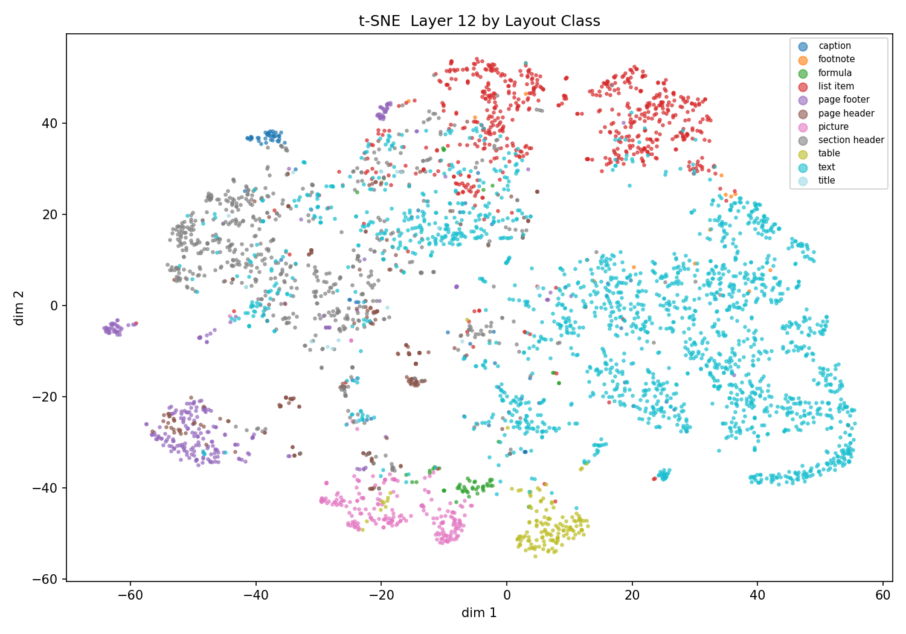
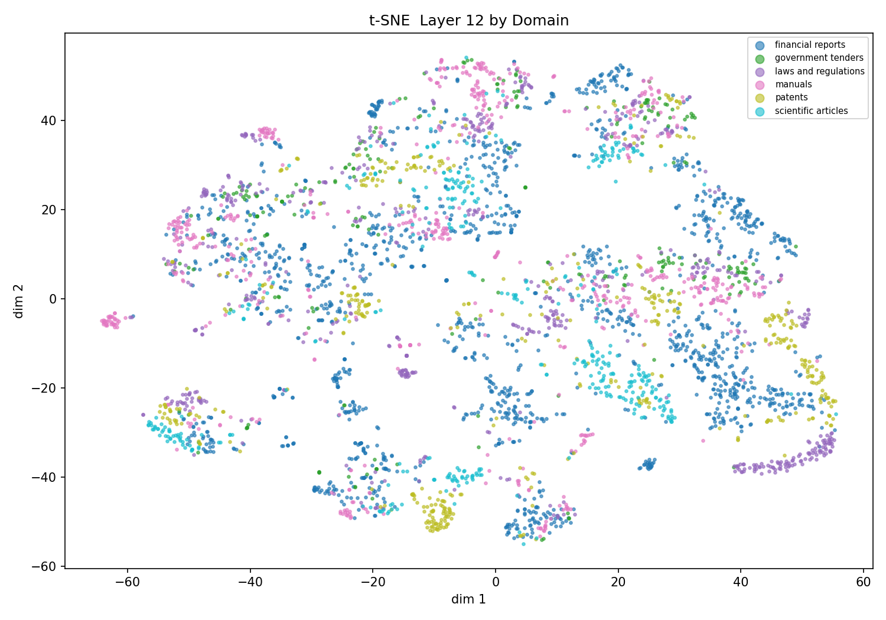
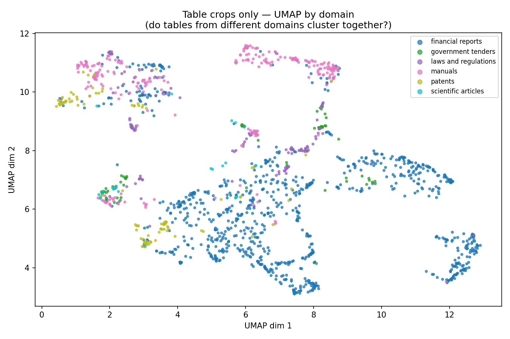

# LayoutProbe

When you train a Vision Transformer on document layouts, what is actually happening under the hood? Is it genuinely learning the universal concept of a "table," or is it just memorizing what tables happen to look like in the specific dataset you fed it? I decided to put together a small experiment to find out.
---

## What is this project in simple words?

Imagine that I am teaching someone to identify furniture by showing them photos from a Restuarant and Office Space then asking them to do the same but in a hospital, This is the core idea of this project but applied to ViT and document analysis. 

I trained ViT on only kinds or domains of documents, completely froze it's leaning and then looked under the hood. The goal of this project was to decode how model stored this information.
Questions are, 
1. Can I extract the layout class?  
2. Can I Identify the original type of document(domain) ?
3. Does model keep this two concepts seperated or Inseparably tangled together? 

---

## The Research Question

> When a ViT is fine-tuned on document layout classification using only some document types, does it learn layout in a general way — or does it mix layout information with domain-specific patterns?
---

## Dataset

To test this, I used **DocLayNet** (IBM Research), a comprehensive dataset of document images featuring bounding box annotations across 11 layout classes and 6 distinct document types.

| Document Type | Role in Experiment | Number of Crops |
|--------------|-------------------|-----------------|
| Manuals | Training | 9,594 |
| Laws & Regulations | Training | 8,744 |
| Financial Reports | Held-out (never seen in training) | 22,805 |
| Scientific Articles | Held-out | 6,048 |
| Patents | Held-out | 6,375 |
| Government Tenders | Held-out | 4,037 |
| **Total** | | **57,603 crops** |

The model was tasked with identifying the following 11 layout classes: caption, footnote, formula, list item, page footer, page header, picture, section header, table, text, and title.

---

## How I Did This (Step by Step)

**Step 1 — Extracted region crops**

Instead of feeding the model full pages, I used the bounding box annotations to cut out individual region images. A single document page might yield 10-15 small crop images, each with a specific ground-truth label like "this is a table" or "this is a title."

**Step 2 — Fine-tuned ViT-B/16**

ViT-B/16 has 12 transformer Layers, After passing through all 12 transformer layers, a special token — the CLS token — summarizes the entire image. I took a ViT-B/16 pretrained on ImageNet and fine-tuned it on layout classification using only our two training domains. After 10 epochs, it reached 95% validation accuracy on those seen domains.

**Step 3 — Froze the model and extracted representations**

Next, I completely froze the model's weights to stop all learning. Then, for every single crop — including those from the four unseen domains — I extracted the internal representations.

The CLS token (a global summary, 768 dimensions)

The mean of all patch tokens (a spatial summary, 768 dimensions)

I concatenated both to create a 1536-dimensional vector per crop

I extracted this at all 12 transformer layers separately. This gave me 12 different snapshots for each crop, showing exactly how the information builds up layer by layer.

**Step 4 — Linear Probing**

This is the most important part of the experiment. I trained two very simple logistic regression classifiers on these frozen representations:

Probe A → predicts the layout class (11 classes)

Probe B → predicts the document domain (6 classes)

So why use something as basic as logistic regression? That's actually the whole point. A linear classifier is pretty simple — it can't learn complex patterns on its own. If it manages to accurately predict the layout or domain, it means the ViT already did the hard work of untangling and organizing that information. The probe isn't doing any heavy lifting; it's just reading the organized data the transformer handed to it.

---

## Results

### Fine-tuning Curve

The model trained well on seen domains:



### Probe A — Layout Classification Across Layers

| Layer | Seen Domains | Unseen Domains |
|-------|-------------|----------------|
| 1 | 0.8164 | 0.5107 |
| 2 | 0.9093 | 0.5539 |
| 3 | 0.9426 | 0.5963 |
| 4 | 0.9663 | 0.6261 |
| 5 | 0.9862 | 0.6482 |
| 6 | 0.9962 | 0.6761 |
| 7 | 0.9994 | 0.6872 |
| 8 | 0.9998 | 0.6799 |
| 9 | 0.9998 | 0.6787 |
| 10 | 0.9998 | 0.6792 |
| 11 | 0.9998 | 0.6804 |
| 12 | 0.9998 | 0.6758 |

### Probe B — Domain Identity Across Layers

| Metric | Value |
|--------|-------|
| 5-fold CV Accuracy | 0.8668 ± 0.003 |
| Chance baseline | 0.17 |
| Signal above chance | +0.70 |

### Layerwise Probe Curves



If you look closely at the layer-wise curves, a clear sequence emerges. Domain accuracy (right plot) shoots up to 86% by layer 3 and stays there. Meanwhile, layout accuracy on unseen domains (left plot, orange line) keeps growing until layer 7 before it plateaus. This tells us exactly how the network operates: it first decides "what kind of document does this look like?" in its earliest layers, and then builds its layout understanding on top of that specific domain context. By layer 5, both concepts are completely entangled.

### UMAP Visualizations

**By Layout Class:**



At first glance, things look great. Each layout class forms its own distinct region in the space. Tables (yellow), pictures (pink), and page footers (purple) are all cleanly separated. This shows the model did genuinely learn layout structure.

**By Domain:**



But now look at this plot, which uses the exact same points colored by document domain. The large blob on the right (dim1 8-13) is almost entirely financial reports (blue). The isolated clusters at the top are laws and manuals. The domains aren't randomly mixed across the layout classes—they dictate their own spatial regions.

Both the layout signal and the domain signal are organizing the exact same space.

Both signals sitting in the same space, So entanglement.

**t-SNE by Layout Class:**



**t-SNE by Domain:**



### example : The Table Clustering Question

Do tables from all domains look the same to the model, or does it still see them as "financial report tables" versus "manual tables"?



This is the most honest result of the whole project. Text and table are the best transferring classes, with F1 of 0.79 and 0.77 respectively on unseen domains.. But look at this plot: financial report tables (blue) form their own massive, separate blob. Manual tables (pink) cluster at the top, and law tables (purple) are off somewhere else. Even our most accurate class is still completely divided by domain underneath. The model never truly learned what a table is in a general sense. It just learned what a table looks like in these specific document types.

### Per-class F1 on Unseen Domains

| Class | F1 |
|-------|----|
| text | 0.7937 |
| table | 0.7730 |
| picture | 0.7081 |
| list item | 0.6326 |
| page footer | 0.6037 |
| section header | 0.4704 |
| page header | 0.1471 |
| title | 0.0300 |
| formula | 0.0232 |
| footnote | 0.0211 |
| caption | 0.0030 |

This creates a sharp divide in how the model operates. Visual classes like tables, pictures, and blocks of text transfer well because their core structural geometry looks similar everywhere. On the other hand, semantic classes like captions, titles, and footnotes completely fail on unseen domains. Their visual appearance is heavily tied to a document's specific style rules—like font sizes, margins, and position—so when the style changes, the entangled representation breaks down.

---

## Conclusion

Three clear findings:

**1. The model learned two things at once without being told to.**
We only trained it to identify layout classes, but it learned document domains as a side effect. The fact that a basic linear classifier can predict the original domain with 87% accuracy from these exact same representations—a full 70 points above random chance—proves this domain information is clearly sitting right there in the embeddings.

**2. Domain gets encoded before layout.**
By layer 3, the domain signal is already strong, while layout understanding on unseen domains keeps developing until layer 7. This means the model first processes "what kind of document is this?" and then builds its layout features on top of that context. The two aren't just mixed—the domain actually acts as the foundation.

**3. Even the best transferring class is domain-separated at representation level.**
Tables scored an impressive 0.77 F1 on unseen domains, which seems great on the surface. But as the UMAP shows, financial tables and manual tables still live in completely separate neighborhoods. The high accuracy isn't because the model learned a truly domain-agnostic concept of a "table." It’s just that tables across different domains happen to share enough surface-level visual features (like gridlines and cells) to scrape past the classifier.
---

## Why Does This Matter?

For anyone building document AI systems across multiple languages and domains multilingual foundation models—this is a real bottleneck. If you train a model on specific document types and expect its layout understanding to transfer cleanly to new ones, you will see a massive performance drop, specifically on semantic layout classes.

The fix likely requires a shift in how we train: either using domain-adversarial training to explicitly scrub the domain signal from the representations during fine-tuning, or ensuring the model is trained on a vastly broader set of document types right from the start.

---

## Project Structure

```
LayoutProbe/
├── src/
│   ├── build_crops.py          
│   ├── dataset.py             
│   ├── finetune.py             
│   ├── extract_features.py     
│   ├── probe.py                
│   └── visualize.py            
├── data/
│   ├── crops/                  
│   ├── crops.json              
│   └── embeddings/             
├── results/
│   ├── best_vit.pth
│   ├── finetune_curve.png
│   ├── layerwise_probe.png
│   ├── umap_layout.png
│   ├── umap_domain.png
│   ├── tsne_layout.png
│   ├── tsne_domain.png
│   ├── pca_layout.png
│   ├── pca_domain.png
│   ├── table_clustering.png
│   └── layerwise_results.json
└── README.md
```

---

## How to Run

```bash
git clone https://github.com/rahulnagilla/LayoutProbe
cd LayoutProbe
pip install torch torchvision scikit-learn pandas pyarrow pillow matplotlib umap-learn

# download val-00000-of-00003.parquet and test-00000-of-00003.parquet, info in DocLayNet/DatasetInfo.txt
# from ds4sd/DocLayNet-v1.1 on HuggingFace and place in project root

python src/build_crops.py
python src/finetune.py
python src/extract_features.py
python src/probe.py
python src/visualize.py
```

---

## References

- Pfitzmann et al. DocLayNet: A Large Human-Annotated Dataset for Document-Layout Segmentation. KDD 2022.
- Nath et al. IndicDLP: A Foundational Dataset for Multi-lingual and Multi-domain Document Layout Parsing. ICDAR 2025.
- Dosovitskiy et al. An Image is Worth 16x16 Words: Transformers for Image Recognition at Scale. ICLR 2021.

---
